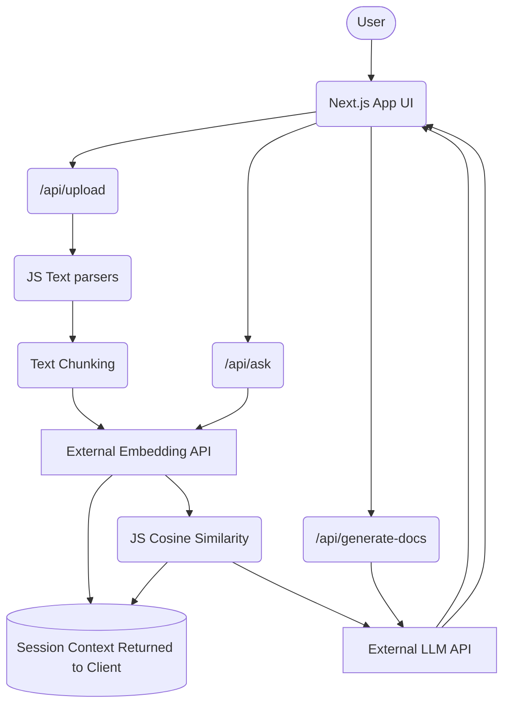

# DocEngine AI - AI-Enhanced Documentation Generator

A powerful **Next.js** application designed for generating executive summaries from technical documents, querying rules and policies by asking questions, and showcasing modern **Serverless RAG (Retrieval-Augmented Generation)** architecture.


## System Architecture

Designed for 100% serverless environments (e.g. Vercel), the application leverages API Routes, external model providers, and in-browser state isolation, eliminating the need for databases.



## Core Features
1. **Intelligent Ingestion**: Upload `.pdf`, `.docx`, or `.txt`.
2. **Contextual Memory**: Vectors are matched cleanly per browsing session.
3. **Smart Summaries**: Structured "Executive Summaries" auto-generated upon document parse.
4. **Source Attribution**: Streaming chat with direct, highlightable source-chunk attribution.

## Installation & Deployment

### 1. Requirements
Ensure you have a `GROQ_API_KEY` and a `HF_TOKEN` (Hugging Face Inference Token). Both APIs can be generated completely free without requiring a credit card.

### 2. Running Locally
Run the following commands:
```bash
npm install
npm run dev
```

Remember to create a `.env.local` file with the keys:
```
GROQ_API_KEY=your_groq_api_key...
HF_TOKEN=your_hf_token...
```

### 3. Deploying to Vercel
Because the stack replaces heavy machine learning packages (`PyTorch`, `FAISS`, `sentence-transformers`) with Node.js cosine-similarity and OpenAI embeddings, **this project fits directly within the strict 250MB Vercel function limits**. 

We dynamically use `serverExternalPackages: ['pdf-parse']` so Next.js seamlessly bypasses canvas/native dependencies blocking build steps.

To deploy simply connect your GitHub branch to Vercel, assign the proper `.env` secrets, and click "Deploy"!
