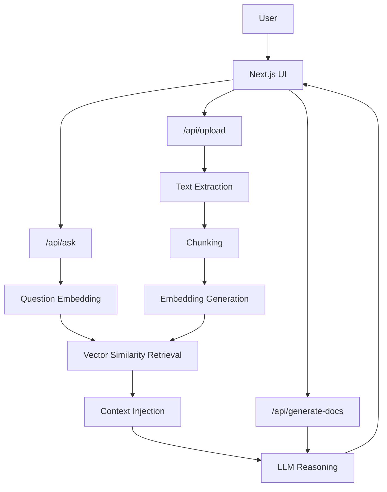

# AI-Enhanced Documentation Generator

Serverless RAG-Based Document Intelligence System

## 🌐 Live Deployment

Document Intelligence Dashboard: https://ai-enhanced-documentation-generator.vercel.app/

## Overview

AI-Enhanced Documentation Generator is a production-oriented document intelligence system that transforms unstructured documents into structured knowledge using a lightweight Retrieval-Augmented Generation (RAG) pipeline.

Instead of sending entire documents to an LLM, the system:

- Extracts document text
- Chunks content into semantic segments
- Generates embeddings for each chunk
- Retrieves relevant context using vector similarity
- Injects focused context into structured prompts

This architecture improves token efficiency, accuracy, and response quality, enabling users to generate structured documentation and ask questions grounded in the document content.

The system is built with Next.js serverless API routes, allowing seamless deployment on Vercel without external backend infrastructure.

## Core Capabilities

### Automated Document Structuring
Converts raw PDFs, DOCX files, and text files into organized documentation sections.

### Context-Aware Question Answering
Answers user queries grounded in retrieved document context using RAG.

### Semantic Document Search
Uses embedding similarity to retrieve the most relevant document segments.

### Lightweight Serverless Architecture
Deployable on Vercel without heavy ML infrastructure.

### Source Attribution
AI responses include reference snippets from the original document.

### Streaming AI Responses
Chat responses stream in real time for faster UX.

### Secure File Processing
File type validation and size limits protect against misuse.

## Architecture

### System Flow

The architecture separates document ingestion, semantic retrieval, and LLM reasoning into modular stages, enabling efficient document understanding without heavy infrastructure.



## Screenshots

### Document Upload Interface
Drag-and-drop document upload supporting PDF, DOCX, and TXT files.


### Structured Documentation Output
Automatically generated documentation sections including:

- Overview
- Key Concepts
- Important Rules
- Action Items
- Summary


### AI Question & Answer
Users can ask contextual questions and receive answers grounded in document content.


## Engineering Decisions & Design Rationale

### Why RAG Instead of Direct Prompting?

Sending entire documents to an LLM can lead to:

- Higher token costs
- Context window limitations
- Slower response times

RAG retrieves only relevant document segments, enabling:

- Faster responses
- Lower cost
- Higher accuracy

### Why Serverless Architecture?

Traditional AI pipelines often require heavy backend infrastructure.

This project uses:

- Next.js API Routes
- External embedding APIs
- External LLM APIs

This allows the system to run entirely on Vercel serverless infrastructure.

### Document Processing Strategy

Each uploaded document goes through these stages:

1. Text Extraction
2. Chunking with Overlap
3. Embedding Generation
4. Vector Similarity Retrieval
5. Context Injection
6. LLM Reasoning

This pipeline ensures context-aware responses without exceeding practical token limits.

## Tech Stack

### Frontend
- Next.js (App Router)
- React
- Tailwind CSS
- Lucide React

### AI Layer
- Groq LLM API (OpenAI-compatible client)
- Hugging Face Inference API (embeddings)
- Custom JavaScript cosine similarity retrieval

### Document Processing
- `pdfjs-dist` (PDF extraction)
- `mammoth` (DOCX parsing)

### Deployment
- Vercel Serverless Platform

## Project Structure

```text
AI-Enhanced-Documentation-Generator/
│
├── screenshots/             # Application screenshots
├── src/
│   ├── app/
│   │   ├── api/
│   │   │   ├── upload/          # Document ingestion
│   │   │   ├── ask/             # RAG Q&A endpoint
│   │   │   └── generate-docs/   # Structured documentation generation
│   │   ├── globals.css
│   │   ├── layout.tsx
│   │   └── page.tsx             # Main application UI
│   │
│   ├── components/
│   │   ├── UploadArea.tsx
│   │   ├── ChatInterface.tsx
│   │   └── DocumentationViewer.tsx
│   │
│   └── lib/
│       ├── chunker.ts
│       ├── embeddings.ts
│       └── rag.ts
│
├── public/
├── package.json
└── README.md
```

## Local Development

### 1) Clone the Repository

```bash
git clone https://github.com/yourusername/ai-enhanced-documentation-generator.git
cd ai-enhanced-documentation-generator
```

### 2) Install Dependencies

```bash
npm install
```

### 3) Configure Environment Variables

Create a `.env.local` file:

```bash
GROQ_API_KEY=your_groq_api_key
HF_TOKEN=your_huggingface_token
```

### 4) Run the Development Server

```bash
npm run dev
```

Open: http://localhost:3000

## Deployment

This project is optimized for Vercel serverless deployment.

```bash
vercel deploy
```

Once deployed, the full system runs through Next.js API routes without a separate backend service.

## Future Enhancements

- Multi-document indexing and cross-document retrieval
- Persistent vector storage (pgvector / Pinecone)
- Document highlighting of answer sources
- Collaborative document workspaces
- Streaming document summarization

## What This Project Demonstrates

- Designing a lightweight RAG system for document intelligence
- Building AI applications using serverless architectures
- Implementing semantic search pipelines without heavy ML infrastructure
- Creating production-ready full-stack AI systems deployable on Vercel
